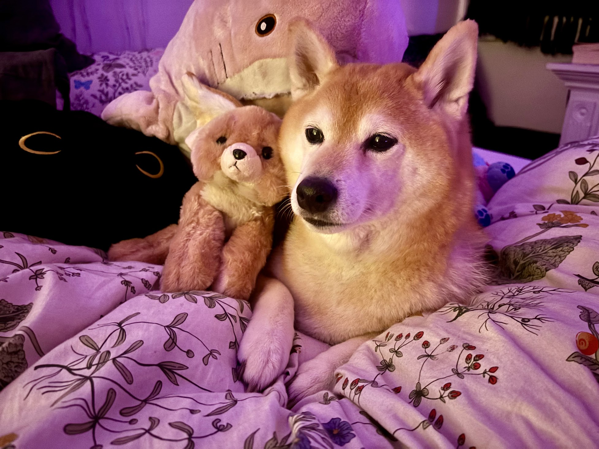

<head>
  <link rel="stylesheet" href="../assets/css/styles.css">
</head>

<body class='cats'>
<header class="navbar">
  <nav id="nav-links" class="nav-links">
    <a href="/sparkle_workshop/">Home</a>
    <a href="/sparkle_workshop/about/">About</a>
    <a href="/sparkle_workshop/lessons/">Lessons</a>
    <a href="/sparkle_workshop/workshop/">Workshop</a>
  </nav>
  
🍔

</header>

<header>
        <h1>Lila James ✨👩‍💻🌙</h1>
        
Hey there! I'm a Technologist, Educator, and Artist with over a decade of international experience. My projects span the space between science and art, as well as machine and human. You can see for yourself on my 🨠
          <a href="https://github.com/LilaShiba" target="_blank">Portfolio</a>
        

        
My approach to projects is to always blend research with physical application. For example, 🧑‍🏫 
          <a href="https://github.com/LilaShiba/SND_Agents/blob/main/Lila%20Jame%20Final%20Paper.pdf" target="_blank">
            my Leading Philosophy & Software Development are informed by a mixture of research and trial
          </a>, 
          offering insights into emerging technologies, their human connections, and how best to utilize them.
        

        
Feel free to 📧 
          <a href="mailto:lilaresearch@gmail.com">lilaresearch@gmail.com</a> 
          with any questions, requests, or for scheduling and pricing.
        

        

          
🶠My Dog ğŸ¶

          
 Say hi to Estelle

          
        

    </header> <!-- end container -->

  <section class="step">
    

      

        <h2>🎓 Education</h2>
      

      

        <h3>Georgia Institute of Technology ğŸ“</h3>
        
M.Sc. in Computer Science (2024)

        <h3>Towson University 📚</h3>
        
B.S. in Sociology (2010)

      
 <!-- end content -->
    
 <!-- end container -->
  </section>

  <section class="section">
    

      

        <h2>💻 Professional Experience</h2>
      

      

        <h3>Unqork 🖥️🌙</h3>
        
Software Engineer | Apr 2020 – 2023

        <ul>
          <li>Developed and launched fintech applications contributing to over $10M in secured contracts 💰.</li>
          <li>Engineered proprietary data frameworks to optimize API performance and scalability 📈.</li>
          <li>Built custom tooling for JavaScript and database interoperability, increasing operational efficiency by 25% 🔧.</li>
        </ul>
      
 <!-- end step glow-hover -->
    
 <!-- end container -->
  </section>

  <section class="step glow-hover">
    

      <h3>🔬 Graduate Research Experience</h3>
      
Design & Intelligence Lab at Georgia Institute of Technology 🧑‍💻✨

      
Graduate Researcher | Dec 2023 – Jun 2024

      <ul>
        <li>Deployed custom LLM-based chat agents using NLP models across three MOOCs, enhancing user engagement 💬.</li>
        <li>Optimized data pipelines, resulting in improved model performance and overall user experience 🚀.</li>
        <li>Collaborated in agile development cycles, contributing to code reviews and Git workflows 🔄.</li>
      </ul>
    
 <!-- end container -->
  </section>

  <section class="step glow-hover">
    

      <h3>🔮💻Decoded</h3>
      
Product Manager & Technology Consultant | Aug 2018 – Mar 2020

      <ul>
        <li>Streamlined client onboarding processes, reducing setup time by 30% ⏱️.</li>
        <li>Maintained a Net Promoter Score (NPS) of over 80% for all clients ⭐.</li>
      </ul>
    
 <!-- end container -->
  </section>

  <section class="section">
    

      

        <h2>Teaching Experience 📚</h2>
      

      

        <h3>🌸📚Teach For America</h3>
        
Secondary English Teacher | Jun 2013 – Jun 2016

        <ul>
          <li>Implemented data-driven instruction techniques to address and close learning gaps 📊.</li>
          <li>Created engaging lesson plans to enhance critical thinking and communication skills 📝.</li>
        </ul>
      
 <!-- end step glow-hover -->
      
      

        <h3>Dwight School 💻✨</h3>
        
IB Computer Science Teacher | Aug 2016 – Jul 2018

        <ul>
          <li>Developed Python and Java curriculum, increasing class enrollment by 300% 📈.</li>
          <li>Applied project-based learning to strengthen algorithm design and problem-solving skills 💡.</li>
        </ul>
      
 <!-- end step glow-hover -->
    
 <!-- end container -->
  </section>

  <section class="step glow-hover">
    

      <h3>💻 Riverdale Country School</h3>
      
Computer Science Teacher | Aug 2023 – Jul 2024

      <ul>
        <li>Designed and taught advanced courses in Creative CS, Statistics with R, and Creative Tech Projects, merging technical skills with artistic expression 🎨💻.</li>
        <li>Applied generative art and procedural storytelling techniques in video game design courses 🎮✨.</li>
        <li>Enhanced curriculum with real-world applications and project-based learning, boosting engagement and problem-solving skills 🔍💡.</li>
      </ul>
    
 <!-- end container -->
  </section>

</body>
